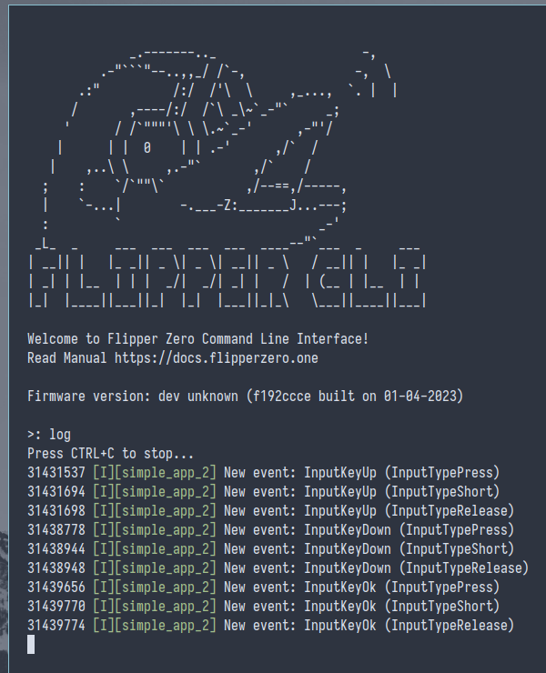

# Simple App 2

Same as [Simple App 1](../simple_app_1/) but it waits for pressing the back button to exit instead of `furi_delay(2000)`.

## Events

```c
static void input_callback(InputEvent* input_event, void* ctx) {
    // check that the context is not null
    furi_assert(ctx);
    FuriMessageQueue* event_queue = ctx;

    // just put the new event in the query we have here
    furi_message_queue_put(event_queue, input_event, FuriWaitForever);
}

typedef struct {
    ...
    FuriMessageQueue* event_queue;
} App;

App* app_alloc() {
    App* app = malloc(sizeof(App));
    ...
    view_port_input_callback_set(app->view_port, input_callback, app->event_queue);
    ...
}

void app_free(App* app) {
    ...
    furi_message_queue_free(app->event_queue);
    ...
}

int32_t simple_app_2_main(void* p) {
    UNUSED(p);

    App* app = app_alloc();

    InputEvent event;
    while(1) {
        // Выбираем событие из очереди в переменную event (ждем бесконечно долго, если очередь пуста)
        // и проверяем, что у нас получилось это сделать
        furi_check(furi_message_queue_get(app->event_queue, &event, FuriWaitForever) == FuriStatusOk);

        if(event.key == InputKeyBack) {
            break;
        }
    }
    ...
```



