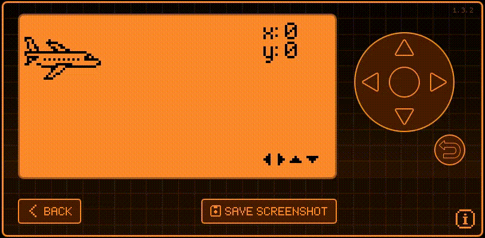

# Simple App 3

This app is a standard "hello world" app with something moving on the screen, position counting and "Esc" button.



## ViewPort

ViewPort is a way to create simple GUI.

Allocate a ViewPort object:

```c
#include <gui/gui.h>

ViewPort* view_port = view_port_alloc();
gui_add_view_port(gui, iview_port, GuiLayerFullScreen);
```

Free a ViewPort object:
```c
view_port_enabled_set(view_port, false); // Disable ViewPort
gui_remove_view_port(gui, view_port); // Remove ViewPort from the Gui 
view_port_free(instance->view_port); // Free memory allocated by view_port_alloc
```

Register callbacks:

```c
void view_port_draw_callback_set(ViewPort* view_port, ViewPortDrawCallback callback, void* context) {

}
void view_port_input_callback_set(ViewPort* view_port, ViewPortInputCallback callback, void* context) {

}
```

The `view_port_draw_callback_set` sets the function that is called **whenever a new frame is signalled to be drawn**. And `view_port_input_callback_set` sets the function that is called **whenever input is recieved**, like a button press.

