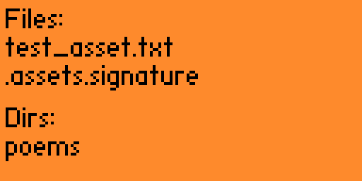

# Simple App 4: Working with storage

New skills:

1. Using storage api to list files from `assets/` directory

From `storage.h`:

> #define STORAGE_APP_ASSETS_PATH_PREFIX "/assets"
> #define APP_ASSETS_PATH(path) STORAGE_APP_ASSETS_PATH_PREFIX "/" path
> example_apps_data_print_file_content(storage, APP_ASSETS_PATH("test_asset.txt"));
> example_apps_data_print_file_content(storage, APP_ASSETS_PATH("poems/a jelly-fish.txt"));
> example_apps_data_print_file_content(storage, APP_ASSETS_PATH("poems/theme in yellow.txt"));
> example_apps_data_print_file_content(storage, APP_ASSETS_PATH("poems/my shadow.txt"));

